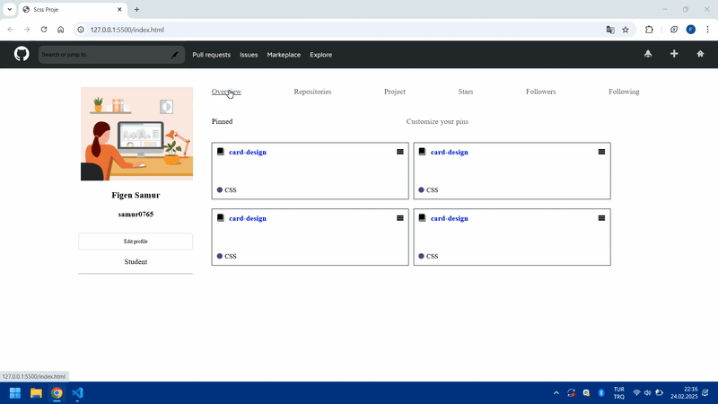

<h1> Scss-Proje-Github </h1>

Bu proje, SCSS kullanarak responsive tasarıma uygun şekilde geliştirilmiş bir web sayfasıdır. Proje, farklı ekran boyutlarına göre optimize edilmiş ve modern bir görünüm sunmak için Flexbox gibi modern özelliklerden faydalanılmıştır.

<h2>Teknolojiler</h2>

SCSS

Responsive Tasarım (Media Queries)

HTML5

<h2>Ekran Görüntüsü</h2>

